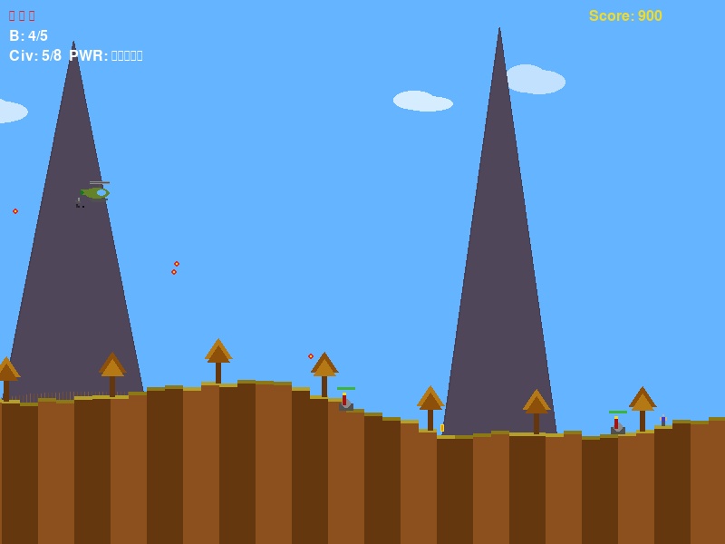

# Heli Rescue

8-bit helicopter rescue game. Fly over terrain, pick up civilians, dodge enemy
guns, and bring everyone home.


<!-- Replace with an actual screenshot once one is taken -->

## How to run

Requires Python 3.10+ with pygame and ymfm-py.

```sh
pip install -e .
python main.py
```

The game will play background music if you place `.vgz` files in `tunes/`.
See [tunes/README.md](tunes/README.md) for details.

## Controls

| Key    | Action          |
|--------|-----------------|
| W A S D | Move helicopter |
| SPACE  | Shoot           |
| M      | Drop bomb       |
| SPACE  | Start / Restart |
| ESC    | Quit            |

## What's this?

A vibe-coding learning project -- built to figure out how a side-scrolling
action game works under the hood. Everything is hand-crafted in a single
Python file:

- **Pixel art** drawn with rectangles, circles, and lines (no sprite sheets)
- **Sound effects** generated from raw waveforms (square waves, noise, sine)
- **Music** plays from VGZ/VGM files via a built-in YM3812 (OPL2) emulator.
  You provide the tunes -- see [tunes/](tunes/README.md) for where to find them
- **Terrain** built from a height map with parallax scrolling layers

It looks and sounds like an 8-bit game, because it basically is one.

## License

GPL v2. Some parts of the codebase were created with AI assistance.
